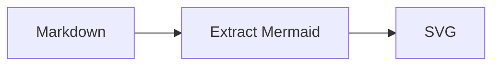

# Mermaid fixtures


```mermaid
flowchart LR
    Input[Markdown] --> Extract[Extract Mermaid]
    Extract --> Output[SVG]
```

```ts
console.log("ignore me");
```

~~~mermaid extra-info
sequenceDiagram
    participant User
    participant CLI
    User->>CLI: export
    CLI-->>User: svg
~~~
